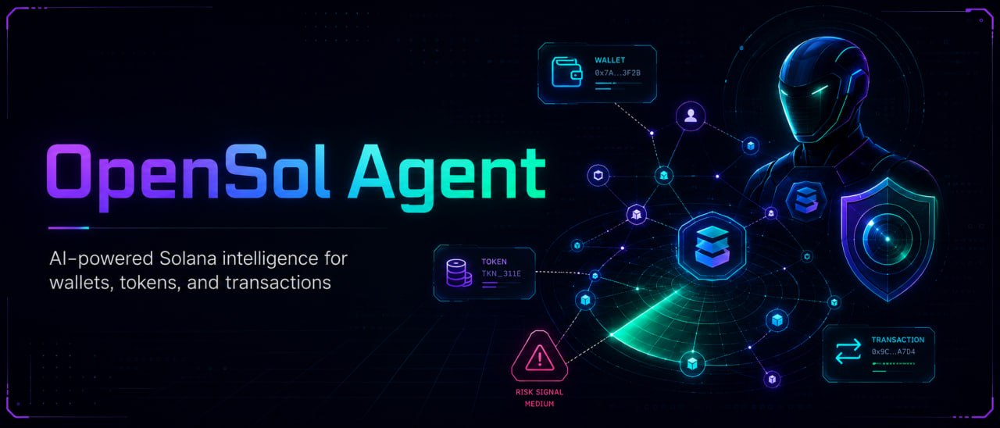
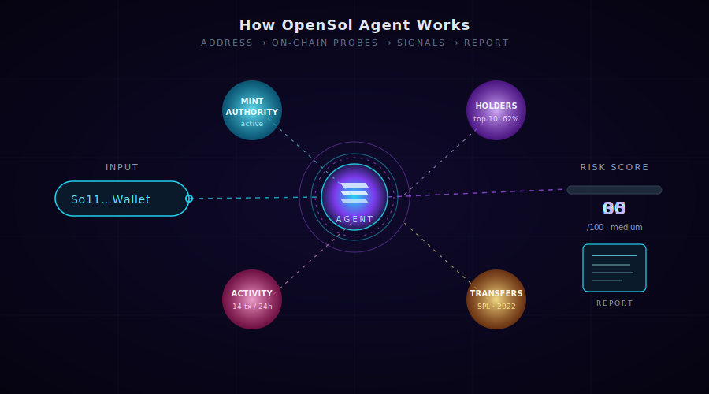

<p align="center">
  
</p>

<h1 align="center">OpenSol Agent</h1>

<p align="center">
  <em>CLI-first Solana intelligence. Turn public wallet, token mint, and transaction data into plain-English investigation reports.</em>
</p>

---

OpenSol Agent is built for researchers, open-source investigators, builders, and analysts who want a transparent first pass over Solana risk signals without running a trading bot, handling private keys, or relying on opaque scoring.

## How It Works

<p align="center">
  
</p>

You give OpenSol Agent a Solana address. It probes the public RPC, gathers on-chain signals — mint authority, holder distribution, recent activity, token transfers — and condenses them into a transparent 0–100 risk score with the reasoning made visible.

No keys. No trading. No black-box scoring.

## Why It Exists

Solana data is public, but raw RPC responses are hard to interpret. OpenSol Agent helps translate that data into structured reports about:

- Token mint authority and freeze authority status
- Token program type, including standard SPL Token and Token-2022 when detectable
- Wallet balance and recent activity patterns
- Basic bot-like or high-activity behavior signals
- Transaction status, fees, accounts, programs, and visible token transfers
- Transparent 0-100 risk scores with limitations called out

## What It Does Not Do

- It does not buy, sell, swap, or trade.
- It does not sign transactions.
- It does not ask for or store private keys.
- It does not provide financial advice.
- It does not claim to prove fraud, manipulation, or intent.

## Install

```bash
npm install
npm run build
```

For local development:

```bash
npm run dev -- token <mint-address>
```

After building, you can run the CLI directly:

```bash
node dist/index.js token <mint-address>
```

Or link it locally:

```bash
npm link
opensol token <mint-address>
```

## Configuration

Create a local `.env` file:

```bash
cp .env.example .env
```

Then set:

```bash
SOLANA_RPC_URL=https://api.mainnet-beta.solana.com
```

If `SOLANA_RPC_URL` is not set, OpenSol Agent falls back to the public Solana mainnet RPC endpoint.

## CLI Usage

Analyze a token mint:

```bash
opensol token <mint-address>
```

Analyze a wallet:

```bash
opensol wallet <wallet-address>
```

Explain a transaction:

```bash
opensol tx <transaction-signature>
```

Export Markdown:

```bash
opensol token <mint-address> --format markdown --out report.md
```

Export JSON:

```bash
opensol token <mint-address> --format json --out report.json
```

Override the RPC endpoint:

```bash
opensol wallet <wallet-address> --rpc https://your-rpc.example
```

## Example Output

```text
# OpenSol Token Risk Report

Risk score: 35/100 (medium)

Summary:
This mint has an active mint authority, which means additional supply may be created by the authority. The freeze authority is disabled. Treat this as an investigation signal, not a final verdict.

Key facts:
- Mint authority: active
- Freeze authority: disabled
- Decimals: 6
- Supply: 1,000,000,000
- Token program: SPL Token
```

See `examples/` for sample token, wallet, and transaction reports.

## Safety Disclaimer

OpenSol Agent is research software. It analyzes public Solana data and generates heuristic reports. Risk scores are not financial advice, legal advice, or proof of wrongdoing. Always verify findings independently.

## Roadmap

- Phase 1: CLI reports for tokens, wallets, and transactions
- Phase 2: Local agent memory and watchlists
- Phase 3: Deeper holder and liquidity analysis
- Phase 4: Dashboard or desktop app
- Phase 5: Plugin system for community analyzers

## Development

```bash
npm run test
npm run lint
npm run build
```

## License

MIT
